# Netflix Clone App

The application was programmatically developed, seamlessly integrating with the TMDB API and designed to adhere to the principles of the MVVM architecture.

### App Icon

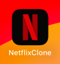

### Dark Mode

    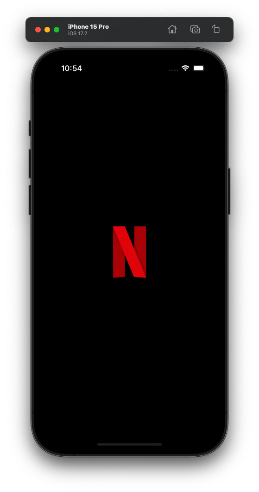
    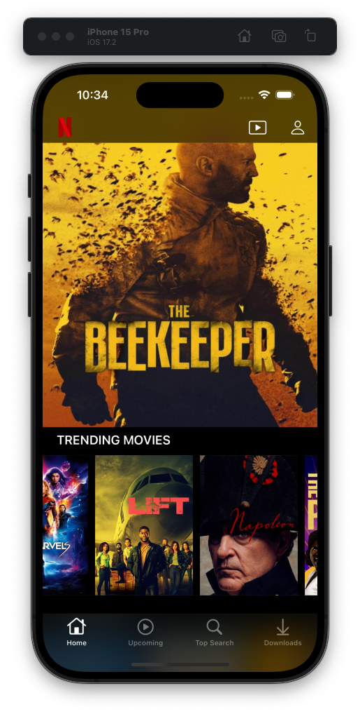
    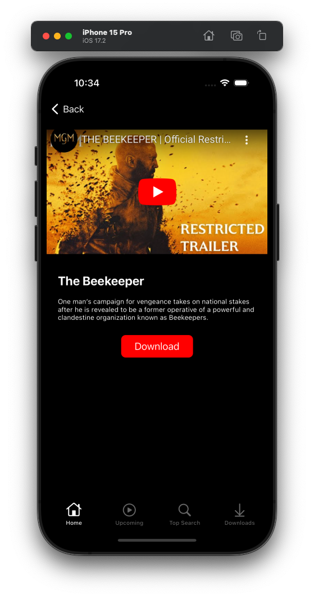
    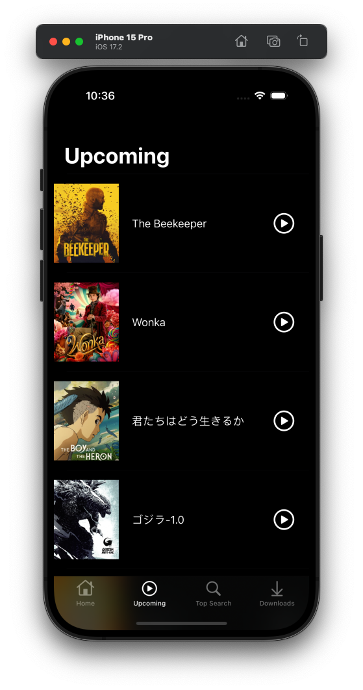
    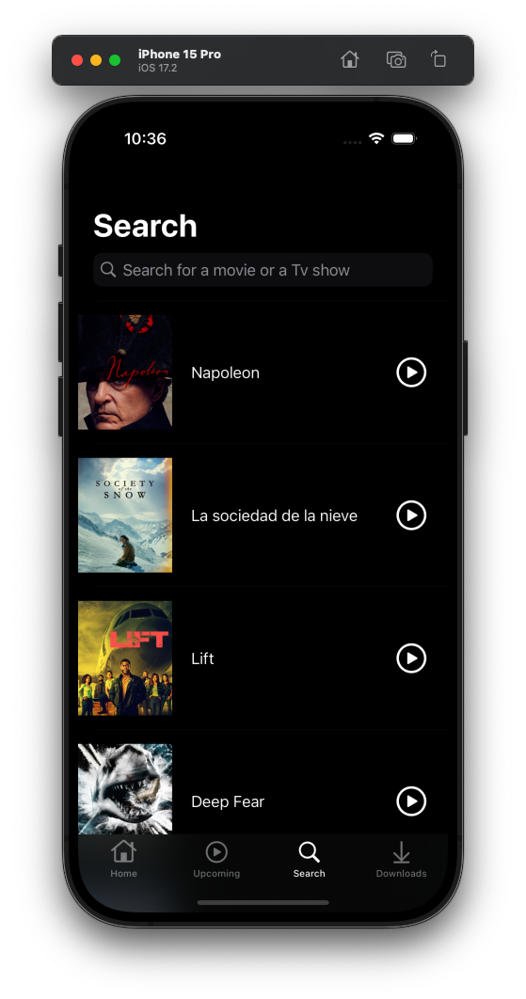
    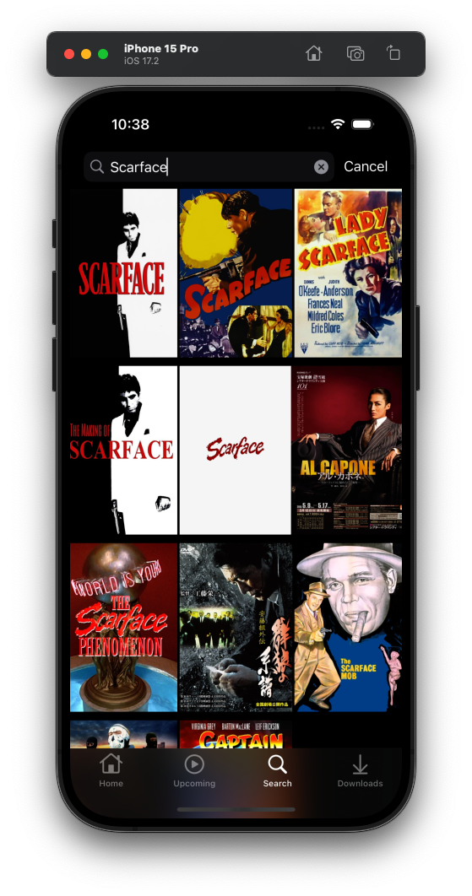
    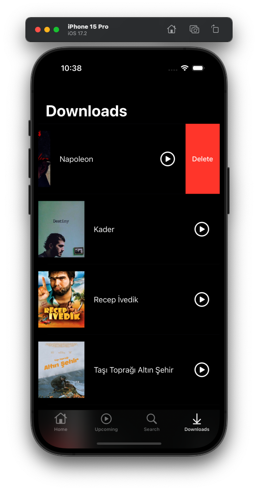

### Light Mode

    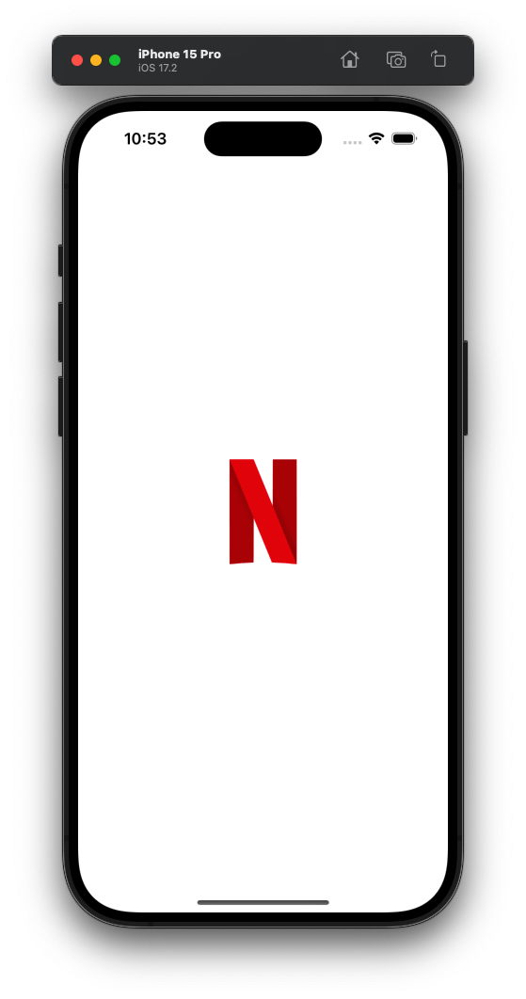
    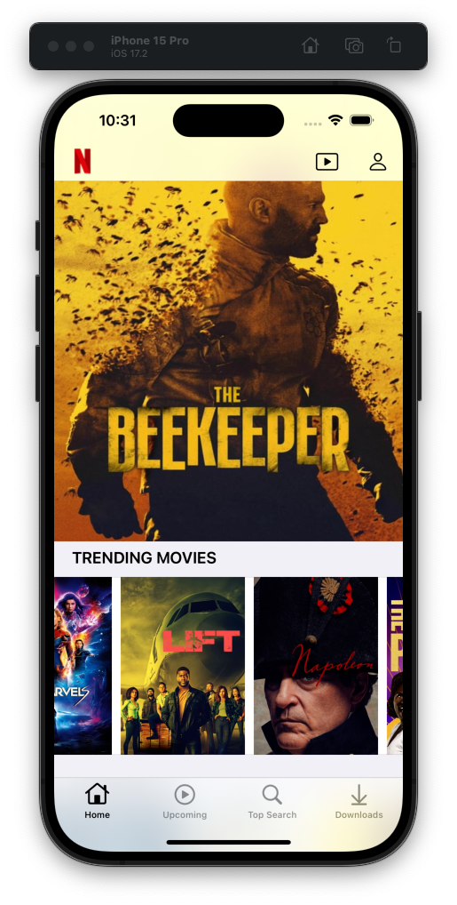
    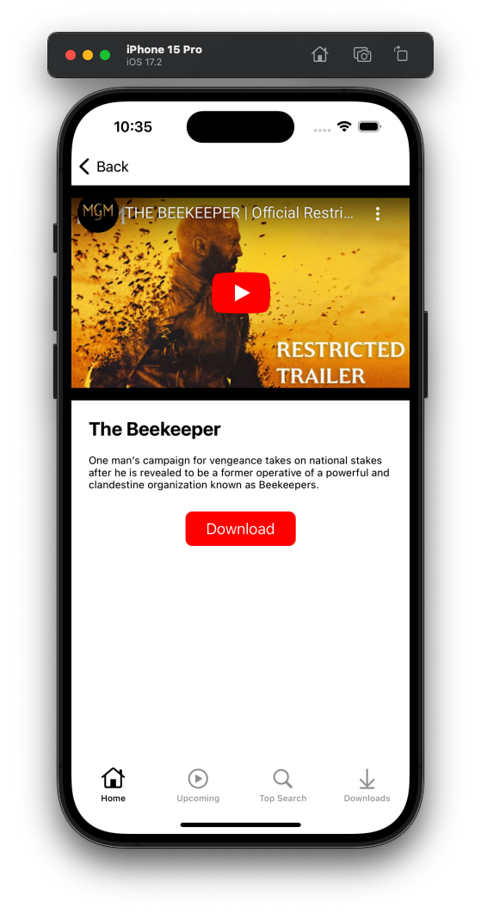
    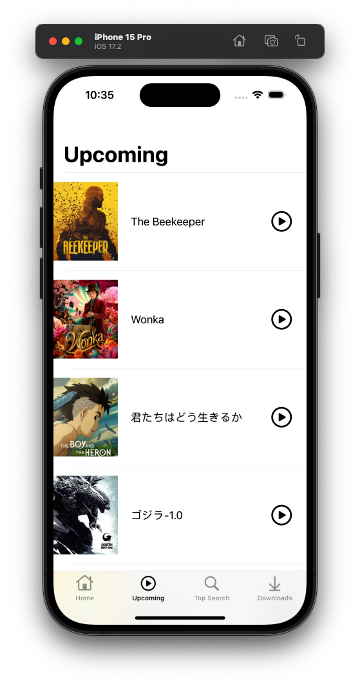
    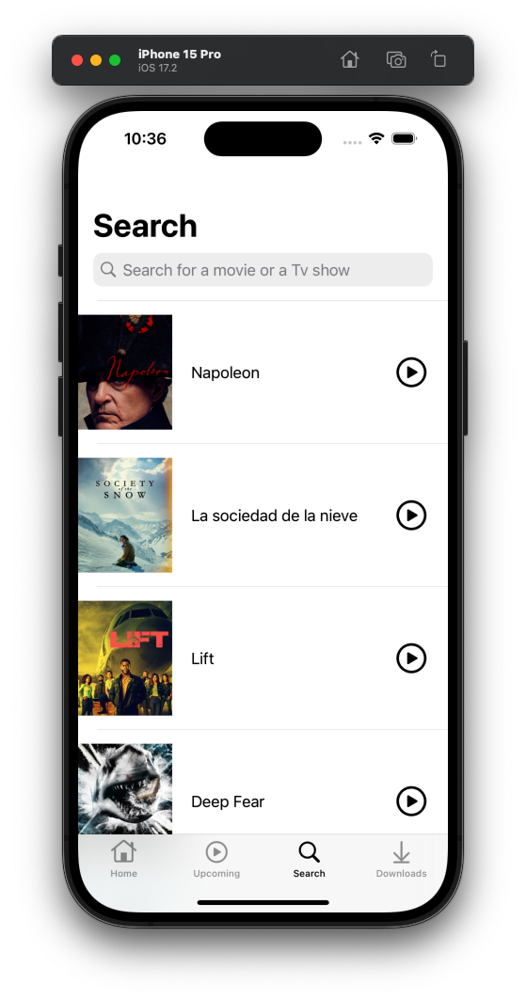
    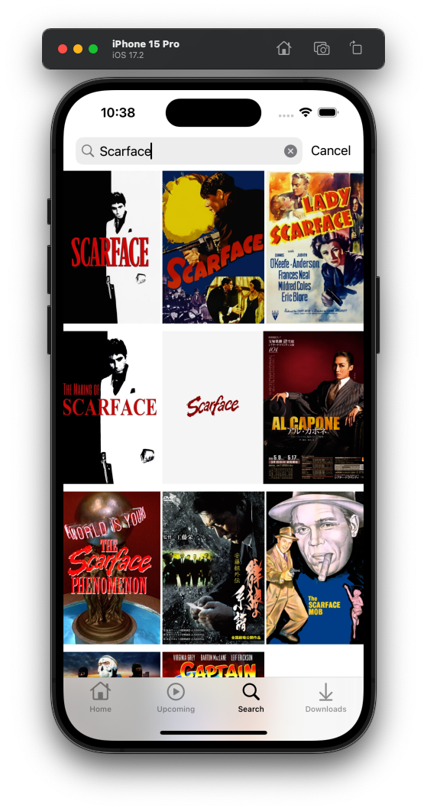
    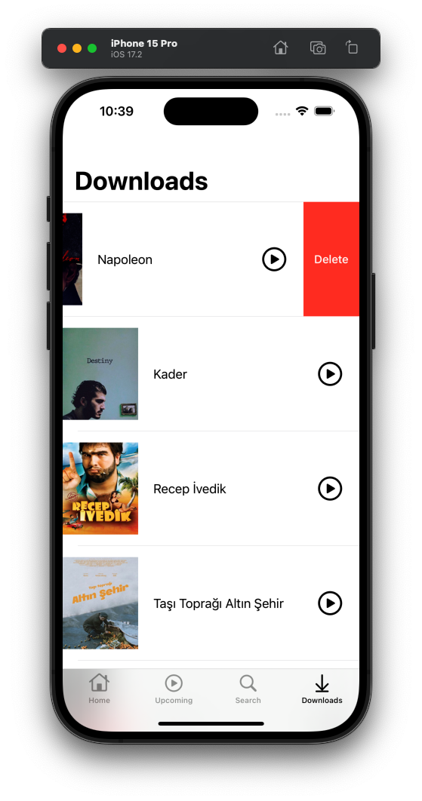

